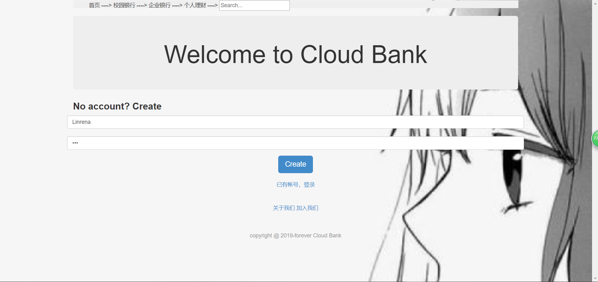
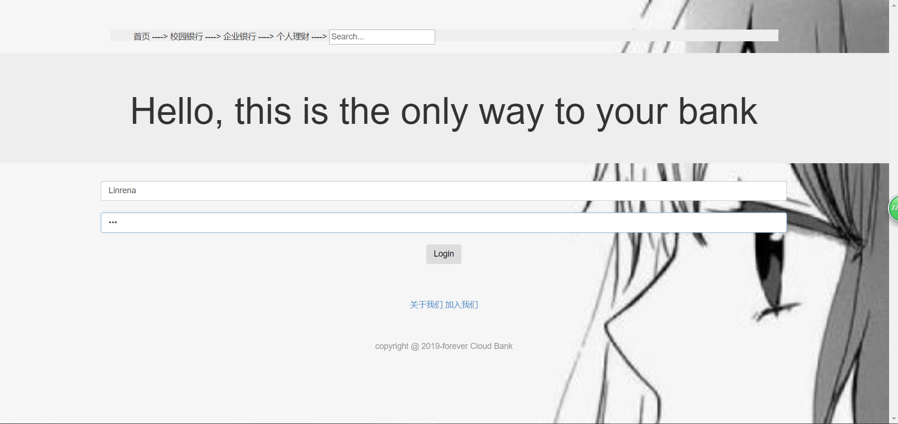
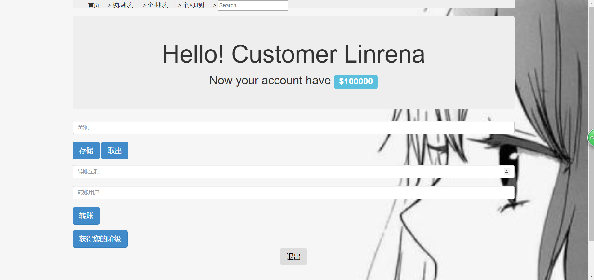
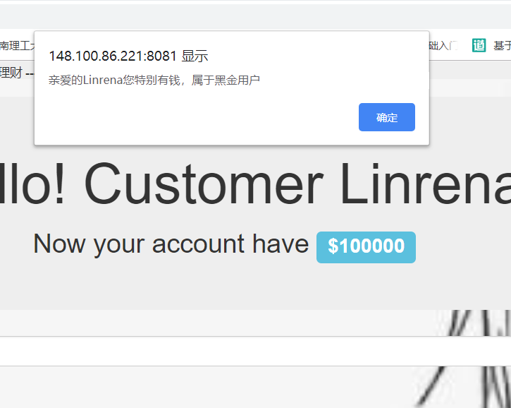
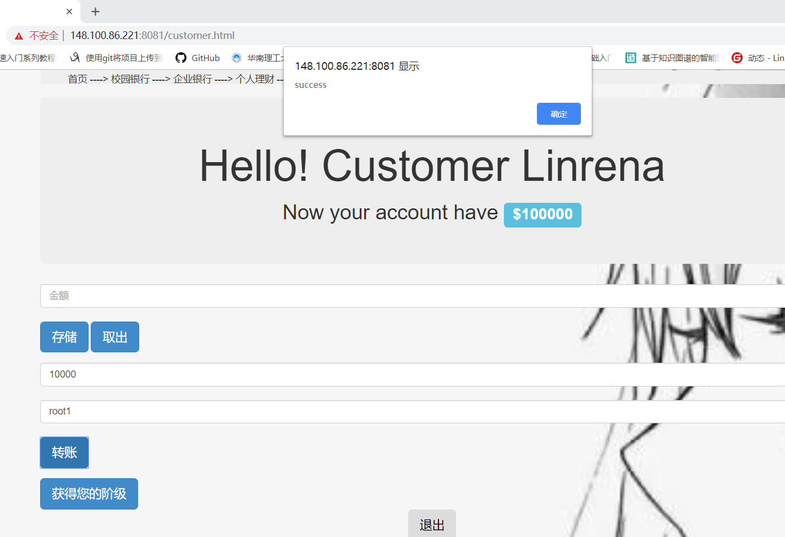

# CloudBank APP

## 项目简介

云计算，这种创新的计算资源使用方式以及基于互联网标准的连接方式，使得传统商业银行可以利用云计算运作业务，以一种更便捷、灵活的方式将各方聚合，并按需分享，实现更高效、紧密的多方协同。而基于云计算技术的云业务模式，则可以通过资源聚合、共享和重新分配，实现资源的按需索取，其中资源包括业务处理能力、信息甚至实物资源等。

LinuxOne 将 Linux 与开放源码结合而成的“巨无霸”级服务器，专为应用经济打造。IBM 公司通过将企业级 Linux 和开放源码的精华结合起来，将 LinuxONE 打造成为最高效、最强大和最安全的 Linux 平台服务器。

我们的云银行APP运行于 LinuxOne 服务器，以上课时学习的[ICp-banking-microservices](https://github.com/IBM/Cloud-Native-Workloads-on-LinuxONE)为基础，进行了改进，添加了转账等功能。

---

## 部署流程

* 1. 安装 Docker
* 2. 安装 docker-compose
* 3. 安装并运行 WebSphere Liberty
* 4. 安装并运行 WordPress
* 5. MEAN Stack 环境准备
* 6. 启动 MEAN Stack

### **1. 安装 Docker**

---

    ```
    linux1@myserver ~]$ sudo su # 切换至 root
    
    [root@myserver linux1]$ cd ~
    
    [root@myserver ~]$ wget ftp://ftp.unicamp.br/pub/linuxpatch/s390x/redhat/rhel7.3/docker-17.05.0-ce-rhel7.3-20170523.tar.gz
    
    # 解压 Docker 归档包
    [root@myserver ~]$ tar -xzvf docker-17.05.0-ce-rhel7.3-20170523.tar.gz
    
    [root@myserver ~]$ cp docker-17.05.0-ce-rhel7.3-20170523/docker* /usr/bin/
    
    #启动docker daemon
    [root@myserver ~]$ docker daemon -g /local/docker/lib &
    ```

### **2. 安装 docker-compose**

---

使用yum安装python-setuptools：
    ```
    [root@myserver ~]$ yum info python-setuptools
    [root@myserver ~]$ yum install -y python-setuptools
    ```

使用easy_install安装pip：
    ```
    [root@myserver ~]$ pip install backports.ssl_match_hostname --upgrade --ignore-installed
    ```

最后，使用pip安装docker-compose：

    ```
    [root@myserver ~]$ yum install python-devel libffi-devel # 先安装依赖，不然会报错
    [root@myserver ~]$ pip install docker-compose==1.13.0
    ```

### **3. 安装并运行 WebSphere Liberty**

---

先手动拉取websphere-liberty镜像到本地：

    ```
    [root@myserver ~]$ docker image pull s390x/websphere-liberty:webProfile7
    
    webProfile7: Pulling from s390x/websphere-liberty
    a39cfce7a60d: Pull complete
    4e699efbddb6: Pull complete
    9a3ffeac4412: Pull complete
    52c5a080fd6d: Pull complete
    6f0d27faa63a: Pull complete
    a3d346a6c218: Pull complete
    e9129f75e0bc: Pull complete
    905ebfd4a924: Pull complete
    bd9b8600bfe7: Pull complete
    5746a3a16c6e: Pull complete
    621479e04496: Pull complete
    26db9a45b5d9: Pull complete
    32c81cd7fa4a: Pull complete
    705855d9301f: Pull complete
    0bd5ae8e4470: Pull complete
    Digest: 
    sha256:87e41c209fa1c8ab33fc0cd0e126eec1493a50c49fe557f398707b4f4755d07a
    Status: Downloaded newer image for s390x/websphere-liberty:webProfile7
    
    [root@myserver ~]$ docker images
    REPOSITORY                TAG                 IMAGE ID            CREATED             SIZE
    s390x/websphere-liberty   webProfile7         def868b21def        27 hours ago        473MB
    
    ```

后台运行容器，并指定端口映射规则：

    ```
    [root@myserver ~]$ docker run -d -p 80:9080 -p 443:9443 s390x/websphere-liberty:webProfile7
    3c9d3b02de11bc5b912a8df1b3987e60bf797ea02cbbbc4457a6e09307f3c95e
    
    [root@myserver ~]$ docker ps
    CONTAINER ID    IMAGE    COMMAND    CREATED    STATUS    PORTS    NAMES
    3c9d3b02de11    s390x/websphere-liberty:webProfile7    "/opt/ibm/helpers/..."    21 seconds ago    Up 19 seconds    0.0.0.0:80->9080/tcp, 0.0.0.0:443->9443/tcp    mystifying_golick
    
    ```

浏览器访问http://[LinuxOne Host IP]，即可看到WebSphere Liberty的界面：


### **4. 安装并运行 WordPress**

---

参见 [运行并安装WordPress](https://github.com/IBM/Scalable-WordPress-deployment-on-Kubernetes/blob/master/docs/deploy-with-docker-on-linuxone.md#steps)

创建并编辑docker-compose.yml：

    ```
    [root@myserver ~]$ vim docker-compose.yml
    
    按i进入编辑模式（所有 Vim 命令注意区分大小写），输入以下内容：
    
    version: '2'
    
    services:
    
      wordpress:
        image: s390x/wordpress
        ports:
          - 8080:80 # 将本地 8080 端口映射到容器的 80 端口
        environment:
          WORDPRESS_DB_PASSWORD: example
    
      mysql:
        image: brunswickheads/mariadb-5.5-s390x
        environment:
          MYSQL_ROOT_PASSWORD: example
    ```

之后按Esc退出编辑模式，输入:wq保存并退出。

创建wordpress目录方便整理：

    ```
    [root@myserver ~]$ mkdir wordpress
    [root@myserver ~]$ mv docker-compose.yml wordpress/
    [root@myserver ~]$ cd wordpress/
    [root@myserver wordpress]$ ls
    docker-compose.yml
    
    ```

根据docker-compose.yml中定义的服务启动容器：

    `[root@myserver wordpress]$ docker-compose up -d

创建完成后，查看相关容器的状态：

    ```
    [root@myserver wordpress]$ docker-compose ps
            Name                       Command               State          Ports
    -------------------------------------------------------------------------------------
    wordpress_mysql_1       /docker-entrypoint.sh mysq ...   Up      3306/tcp
    wordpress_wordpress_1   docker-entrypoint.sh apach ...   Up      0.0.0.0:8080->80/tcp
    
    ```

浏览器访问http://[Your LinuxONE IP Address]:8080，即可看到 WordPress 的页面：


### **5. MEAN Stack 环境准备**

---

拉取代码到本地使用

    ```
    [root@myserver ~]$ git clone  https://github.com/YOUR_USERNAME/CloudBankApp
    
    [root@myserver ~]$ cp -r CloudBankApp/files/mean-docker ./
    
    [root@myserver ~]$ yum install -y tree
    
    [root@myserver ~]$ tree mean-docker
    
    ```

docker-compose.yml修改如下：

    ```
    ...
    ...
        ports:
          - "8081:8081" # 本地 8081 端口映射到 express 容器的 8081 端口
    ...
    ...
    ```

express-server/Dockerfile修改如下：

    ```
    #Expose the port the app runs in
    EXPOSE 8081
    ...
    ...
    # Express listening port
    ENV PORT 8081
    ```

### **6. 启动 MEAN Stack**

---

在mean-docker目录下运行docker-compose up：

    ```
    [root@myserver mean-docker]$ docker-compose up
    
    Starting meandocker_database_1 ...
    Starting meandocker_database_1 ... done
    Starting meandocker_express_1 ...
    Starting meandocker_express_1 ... done
    Attaching to meandocker_database_1, meandocker_express_1
    database_1  | note: noprealloc may hurt performance in many applications
    express_1   |
    express_1   | > node-todo@0.0.1 start /usr/src
    express_1   | > node server.js
    express_1   |
    express_1   | App listening on port 8081
    
    ```

 使用docker-compose -d即可在后台运行express-server

 浏览器访问http://[ip of machine]:8081，即可看到你的App

使用docker-compose ps命令查看启动的容器：

    ```
    [root@myserver mean-docker]$ docker-compose ps
            Name                       Command               State                  Ports
    ----------------------------------------------------------------------------------------------------
    meandocker_database_1   /bin/sh -c mongod --dbpath ...   Up      0.0.0.0:27017->27017/tcp, 28017/tcp
    meandocker_express_1    npm start                        Up      0.0.0.0:8081->8081/tcp
    ```

---

## 项目设计文档

### **前端页面**

* 银行首页
* 登陆页面 
* 存钱页面
* 取钱页面
* 转账页面

### **前端业务逻辑**

```
1. 注册界面：
    a. 注册成功 --> 登陆界面
    b. 有账号，直接登录 --> 登陆界面
2. 登录界面：
    a. 登陆成功 --> 账户首页界面
    b. 注册账号 --> 注册界面
3. 账户首页界面
    a. 存款取款：输入存取款金额 --> 存取款成功
    b. 转账：输入目标用户，输入转账金额 --> 转账成功
```

### **后端业务逻辑**

```
1. 注册：
    在数据库中创建对应元组
2. 登录：
    对应输入的账户名和密码，对应数据库数据
    a. 若输入正确，则提示登陆成功，跳到个人账户首页界面，显示账户名和余额
    b. 若输入失败，提示
3. 首页：
    a. 存款、取款：获取数据，写入数据库，并且更新账户余额
    b. 转账：获取数据，查找是否有相应目标用户，若有，更新两人余额
```

### **数据库设计**

#### 用户信息表

| account | password | balance       |
|:-------:|:--------:|:-------------:|
| root    | root     | 8888888888888 |
| 123     | 123      | 10000         |
| 123456  | 123456   | 50000         |

#### 存取记录表

| account | amount | balance | type |
|:-------:|:------:|:-------:|:----:|
| 123     | 5000   | 15000   | 存入   |

#### 转账记录表

| source_account | target_account | amount |
|:--------------:|:--------------:|:------:|
| 123            | 123456         | 100    |

---

## Application使用说明

* 1. 注册
* 2. 登录
* 3. 存款
* 4. 取款
* 5. 转账
  
### **注册**

点击注册按钮，输入 account 和 password，点击下方的注册按钮


---


### **登录**

输入 account 和 password，点击确认按钮
此时界面会显示你的账户名和余额，以及系统提供的基本服务选项


---

### **存款**

输入你想要存储的金额，点击确认按钮



---

### **取款**

输入你想要取出的金额，点击确认按钮


---

### **转账**

输入转账目标账户和转账金额，点击确认按钮



---

